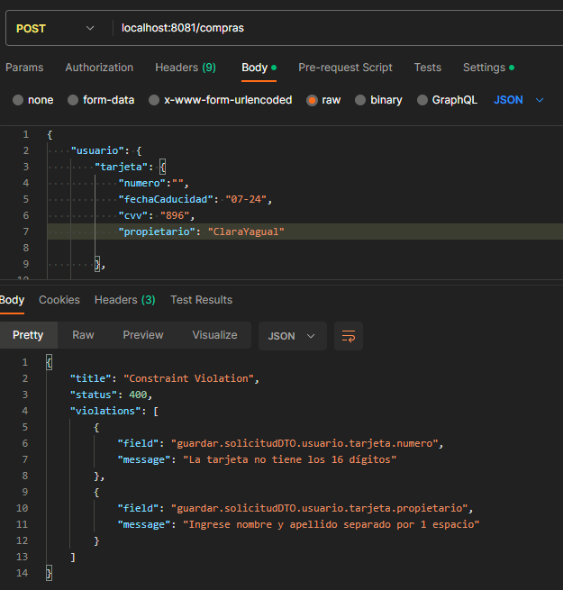

# Learning Report Day 2 - ComprasAPI
I am creating this .md file in order to recap all the troubleshooting's and new things that I possibly learn during this first day.
Writing helps me review and I feel I learn more when I write down what I went through to reach the goal.
## Automating the total
Something that I want to do is that once I set my list of products, automatically calculates the total to pay and assign it to 'total'
field. So I did it using a bit of stream() and reduce in Solicitud.java.
```
private Double calculate(List<Producto> productos){
        return productos.stream().map(producto -> {
            var precio = producto.getPrecio();
            var cantidad = producto.getCantidad();
            return precio * cantidad;
        }).reduce(Double::sum).orElse(0.0);
}
```
This was giving a NullPointerException because I was trying to do:
```
total = calculate(productos);
```

So, I solved it with a void method and call it before I persist in the database:

Solicitud.java
```
public void setCalculate(){
        this.total = calculate(usuario.getProductos());
}
```

SolicitudRepository.java
```
public Uni<Solicitud> add(Solicitud solicitud){
        solicitud.setCalculate();
        return persist(solicitud).call(solicitud1 -> searchById(solicitud1.getSolicitudId()));
}
```

### _Holy validations Batman!_

## Validations with jakarta

Let's be honest: Doing validations is not funny and that's the reason that it took me a little effort
to finish all of them. I admit that I was really out of practice. Even in my springboot practices 
I avoid doing validations (_sighs_)

Ok, first at all the dependecy that you need.
```
<dependency>
      <groupId>io.quarkus</groupId>
      <artifactId>quarkus-hibernate-validator</artifactId>
</dependency>
```

So, next thing is to understood how validations work here.

**@Valid** is the main character here, because it behaves as a trigger that activates all the annotations
that validades a specific requirement: field can't be null, blank, must have a character length, follow a format, etc.
The most aesthetic way to use it is on the Resource layer, because the output when a validation gets activated it is a
readable JSON that shows you the configured message and the field where the validation is.



As you can appreciate in the pic, two validations were triggered: First one because 'numero' field was blank and then 'propietario'
has not a space between the name and the surname.

So, in order to validations being triggered properly, follow up the next steps:

1. Set @Valid in the Resource layer, aside of the object that will be sent in POST/PUT operations.
2. If you have objects inside your DTO (In my case SolicitudDTO has Usuario) and if you have nested 
objects (Usuario has Tarjeta and List<Producto>), mark all of them with @Valid as well.
3. Check that the annotations that you are using validate what you really want and customize your own messages in
each of them. Don't be like me, I was using some annotations _thinking_ that will do what I expect just for the name.
4. Adding @Valid in the entity (Solicitud) is not necessary

And that's it with day 2 (I think). Let's keep going with day 3~


