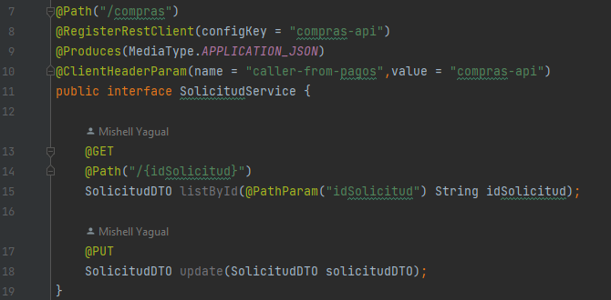

# Learning Report Day 4 - PagosAPI
I am creating this .md file in order to recap all the troubleshooting's and new things that I possibly learn during this first day.
Writing helps me review and I feel I learn more when I write down what I went through to reach the goal.

## Follow up what you already do

Well, for PagosAPI in this day there is not much to comment since I have to replicate same stuff I did in ComprasAPI.

Something that I have to accomplish is the communication with compras-api in order to send an answer related if the solicitud
was successful or not. What I did is using the rest reactive dependency that Quarkus provides, but it is not me main idea. On day
6 it will be changed to websockets. I just left the configuration like that as a future remind.

The dependency is this one:

```
<dependency>
<groupId>io.quarkus</groupId>
<artifactId>quarkus-rest-client-reactive-jackson</artifactId>
</dependency>
```
You can find more about it [here](https://quarkus.io/guides/rest-client-reactive) and [here](https://quarkus.io/guides/resteasy-reactive).

Basically this dependency acts as a _copy-mirror machine_. Because you create a copy of what did you have in ComprasAPI 
service and dto layers. For the last one you will need everything, but for service you can decide what are the
methods that you really need. You can check what I mean in the client folder in SolicitudDTO and SolicitudService. Let's take a look
to the last one mentioned



Yes, more annotations to use:

- **@Path("/compras"):** This annotation specifies the base path for all the resource methods in the interface. In this case, 
all the endpoint paths defined in the SolicitudService interface will start with /compras. Remember that this is the path already
configured in ComprasAPI

- **@RegisterRestClient(configKey = "compras-api"):** This annotation is used in Quarkus to register the interface as a 
REST client. It specifies the configuration key "compras-api", which is used to configure the client properties.

- **@Produces(MediaType.APPLICATION_JSON):** This annotation indicates the media type that the REST client will produce when 
making requests. In this case, it specifies that the client will produce JSON responses.

- **@ClientHeaderParam(name = "caller-from-pagos",value = "compras-api"):** This annotation allows you to add custom headers 
to the requests made by the REST client. In this case, it adds a header with the name "caller-from-pagos" and the value "compras-api" to all requests.

Aditional, you must set up in application.properties

```
compras-api/mp-rest/url=http://localhost:8081

quarkus.tls.trust-all=true
```

Finally, at your PagosAPI resource layer you must inject it.

```
@RestClient
private final SolicitudService solicitudService;
```

And that's it. Of course ComprasAPI must be running in order to have access to the methods that you mirrored here in PagosAPI.

See ya, on day 5.


